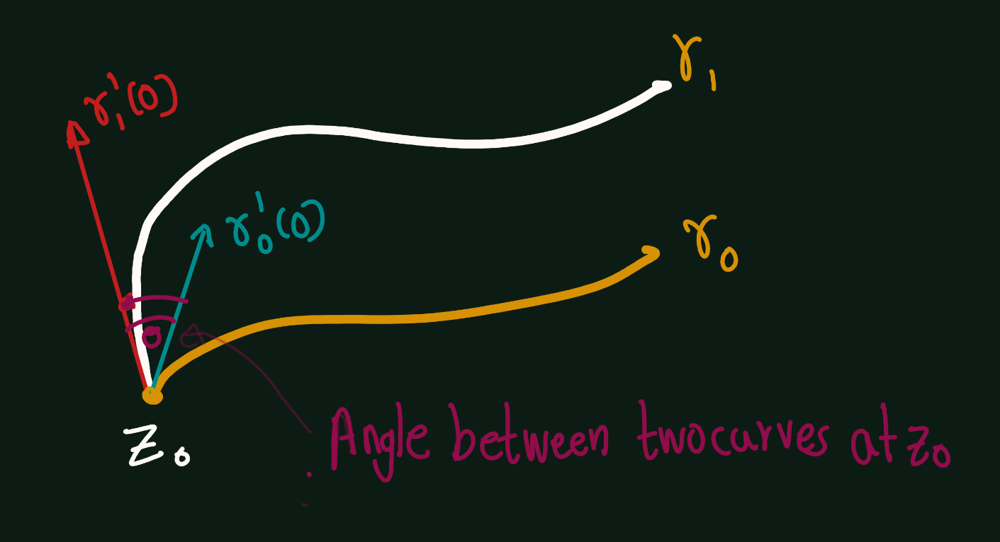
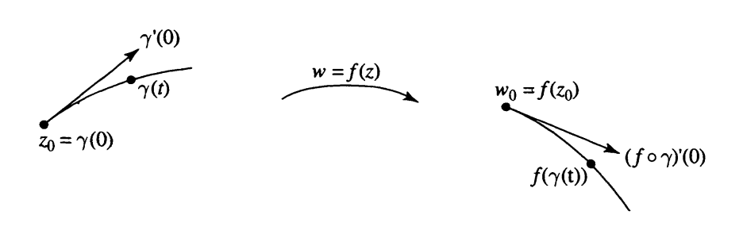

# Conformal Mappings

```{definition,name='Tanagent Vector'}
Let $\gamma(t) = x(t) + iy(t), 0\leq  t \leq  1$, be a smooth parameterized curve terminating at $z_0 = \gamma(0)$. We refer to 
\[\gamma'(0) = \lim_{t \to 0} \frac{\gamma(t)-\gamma(0)}{t} = x'(0) + iy'(0)\]
as the tangent vector to the curve 'Y at ZOo
```

```{definition,name='Angle between two curves '}
We define the angle between two curves 
at $z_0$ to be the angle between their tangent vectors at $z_O$.
```

```{r echo=FALSE}
  
```

```{theorem} 
If $\gamma(t)$, $0 \leq t \leq 1$, is a smooth parameterized curve terminating at $z_0 = \gamma(0)$, and $f(z)$ is analytic at $z_0$, then the tangent to the curve $f(\gamma(t))$ terminating at $f(z_0)$ is given by:
\begin{equation}
(f \circ \gamma)'(0) = f'(z_0)\gamma'(0)
\end{equation}
```

```{r echo=FALSE}
  
```

```{proof}
- If $\gamma'(0) \neq 0$, then $\gamma(t) \neq \gamma(0)$ for $t$ near $0$, $t \neq 0$, so we may write 
\begin{equation}
\frac{f(\gamma(t)) - f(\gamma(0))}{t} = \frac{f(\gamma(t)) - f(\gamma(0))}{\gamma(t) - \gamma(0)} \cdot \frac{\gamma(t) - \gamma(0)}{t}
\end{equation}
and pass to the limit, to obtain the formula (6.1). 
- If $\gamma'(0) = 0$, then proceeding as in Section 2, we obtain $(f \circ \gamma)'(0) = 0$, and again the formula holds.

```