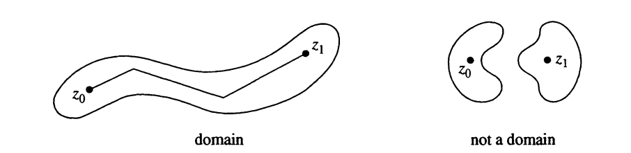

# Uniformization by square domains

```{definition,name='Domain'}
A subset $D$ of the complex plane is a domain if $D$ is open and if any two points of $D$ can be connected by a broken line segment in $D$.
```

```{r echo=FALSE}
  
```

```{example}
- **Examples**: 
  - Open half planes
  - Open disks
  - Open sectors
  - Open annuli, 
  - Open punctured disks. 
- **Non Examples**: 
  - Union of the open upper and lower half-planes $=U = \mathbb{C}\setminus\mathbb{R}$.\
(It is impossible to connect a point in the upper half-plane to a point in the lower half-plane by a broken line segment that does not cross the real line. )
```

```{definition,name='Riemann Sphere'}
The Riemann sphere, also called the extended complex plane consist of the complex numbers $\mathbb{C}$ together with $\infty$. The set of extended complex numbers may be written as $\mathbb{C} \cup \{\infty\}$.
```
**Notation**: $\hat{\mathbb{C}}=\mathbb{C} \cup \{\infty\}$

```{r echo=FALSE,out.height="50%",fig.align='center'}
  knitr::include_graphics('figures/Mario_Bonk/fig2.png')
```

```{definition}
A domain in the plane is "simply connected" if it has no "holes."
```

```{example}
- **Example** 
  - Disks 
  - Rectangles
- ***Non Example**
  - Annuli 
  - Punctured disks
  - Punctured plane \
(Becasue they have "holes")
```

Later we discuss this more precise

```{definition,name='Meromophic'}
A function $f(z)$ is meromorphic on a domain $D$ if $f(z)$ is analytic on $D$ except possibly at isolated singularities, each of which is a pole.
```


```{proof}
(Proof of Therom 1.1 in th paper)\
Let $\Omega$ be a finitely connected domain in $\hat{\mathbb{C}}$ with $\infty\in \Omega$ It is a known fact that there exists a conformal map $g$ of $\Omega$ onto a square domain $\tilde{\Omega}$ with the normalization
$$g(z) = z + \frac{b_1}{z} + \ldots$$ 
near $\infty$.

The map $f \in \mathcal{F} \mapsto \tilde{f} := f \circ g^{-1}$ is a bijection between $\mathcal{F}$ and $\tilde{\mathcal{F}}$. Moreover, if
$$f(z) = z + \frac{a_1}{z} + \ldots ~\text{ and } \tilde{f}(z) = z + \frac{\tilde{a_1}}{z} + \ldots$$ near $\infty$, then $\tilde{a}_1 = a_1 - b_1$.
```

Let \( f \) be as in the statement. We consider the rectangle \( R = [-l,l] \times [-r,r] \subset \mathbb{C} \) for large \( r > 0 \). Here we chose \( l= = r^{2/3} \) so that
\[ \frac{l}{r} \to  0 \quad \text{and} \quad \frac{r}{l^2} \to 0\]
as \( r \to \infty \).

In the following, we assume that \( r \) is so large that \( \widetilde{C}\setminus \Omega \) is contained in the interior of \( R \). Then \( \partial R \subset \widetilde{C}\setminus \Omega \) and \( j=f(R) \) is a Jordan curve in \( \mathbb{C} \). We want to


\begin{eqnarray}
A &=& \frac{1}{2i} \int_J \bar{w} dw\\
&=& \frac{1}{2i} \int_{\partial R} \bar{f(z)}f'(z) dz\\
&=& \frac{1}{2i} \int_{\partial R} \overline{\left(z + \frac{a_1}{z} + \ldots \right)} \left(1 - \frac{a_1}{z^2} + \ldots \right) dz\\
&=& \frac{1}{2i} \int_{\partial R} \left(\bar{z} + \frac{\bar{a}_1}{\overline{z}}-\frac{\bar{a}_1\bar{z}}{z^2} + O\left(\frac{1}{|z|^2}\right)\right) dz\\
&=& 4rl + \int_{\partial R} \text{Im} \left(\frac{\bar{a}_1 z}{\bar{z}}\right) \frac{dz}{z} + o(1).
\end{eqnarray}


Sure, I can provide a proof for the proposition. Here it goes:

**Proposition**: If a set $A$ is a subset of the interior of another set $B$ (denoted as $A \subseteq Int(B)$), then the complement of $A$ (denoted as $A^c$) is a subset of the boundary of $B$ (denoted as $bd(B)$).

**Proof**:

Let's denote the interior of $B$ as $Int(B)$ and the boundary of $B$ as $bd(B)$. By definition, we have:

1. $Int(B) = B - bd(B)$
2. $A^c = U - A$ where $U$ is the universal set.

Given that $A \subseteq Int(B)$, we can say that $A$ does not contain any points from $bd(B)$. Therefore, all points in $bd(B)$ must be in $A^c$.

Hence, $A^c \subseteq bd(B)$.

This completes the proof. Please note that this is a general proof and the specifics might vary depending on the exact definitions and properties of the sets and the topological space they are in. If you have a specific example or further questions, feel free to ask! 