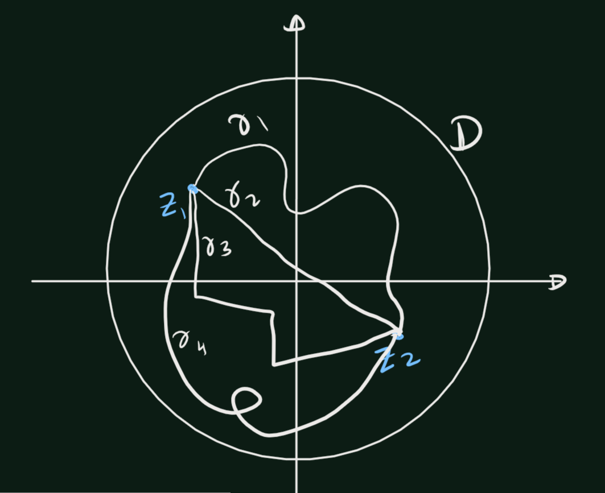

# Riemann Mapping Theorem
```{theorem,name='Riemann Mapping Theorem'}
If $D$ is a simply connected domain in the complex plane, and $D$ is not the entire complex plane, then there is a conformal map of $D$ onto the open unit disk $\mathbb{D}$.
```

## Hyperbolic Geomeery
Suppose $w = f(z)$ is a conformal self-map of the open unit disk $\mathbb{D}$. From Pick's lemma we then have equality, 
$$\left|\frac{d\omega}{dz}\right|=\frac{1-|\omega|^2}{1-|z|^2}$$
In differential form this becomes 
$$\frac{|dw|}{1-|w|^2} = \frac{|dz|}{1-|z|^2},$$
which means that if $\gamma$ is any smooth curve in $\mathbb{D}$, and $\omega=f(z)$ is a conformal self-map of $\mathbb{D}$, then 
$$\int_{f\circ \gamma}\frac{|dw|}{1-|w|^2} =\int_{\gamma} \frac{|dz|}{1-|z|^2}.$$
Thus to obtain a length function that is invariant under conformal self-maps of $\mathbb{D}$,we are led to make the following definition. 

```{definition}
We define the length of $\gamma$ in the hyperbolic metric by 
\[\text{hyperbolic length of } \gamma =2\int_{\gamma} \frac{|dz|}{1-|z|^2}\] 
```

The factor 2 is a harmless factor, which is often omitted. (It adjusts the 
metric so that its curvature is -1.)

```{definition}
The hyperbolic distance \(\rho(z_0, z_1)\) from \(z_0\) to \(z_1\) is defined as the infimum (greatest lower bound) of the hyperbolic lengths of all piecewise smooth curves in \(\mathbb{D}\) from \(z_0\) to \(z_1\).
\[\rho(z_0, z_1)
  =\inf_\gamma\left\{\text{hyperbolic length of } \gamma \right\}
  =\inf_\gamma\left\{2\int_{\gamma} \frac{|dz|}{1-|z|^2}\right\}\]
```

```{r echo=FALSE}
  
```

Since conformal self-maps of $\mathbb{D}$ preserve the hyperbolic lengths of curves, they also preserve hyperbolic distances. That is, for any conformal self-map $w = J(z)$ of $\mathbb{D}$,
\[ \rho(f(z_0), f(z_1)) = \rho(z_0, z_1), \quad \text{where } z_0, z_1 \in \mathbb{D}. \]


```{r echo=FALSE}
  knitr::include_graphics('figures/Riemann_Mapping_Therom/fig2.png')
```

```{theorem}
For any two distinct points \(z_0, z_1\) in the open unit disk \(\mathbb{D}\), there exists a unique shortest curve in \(\mathbb{D}\) from \(z_0\) to \(z_1\) in the hyperbolic metric. Specifically, this curve corresponds to the arc of the circle passing through \(z_0\) and \(z_1\) that is orthogonal to the unit circle.
```

```{definition}
The paths of shortest hyperbolic length between points are called **hyperbolic geodesics**.
```
- These hyperbolic geodesics play a role similar to that of straight lines in Euclidean geometry. They satisfy all the axioms of Euclidean geometry except for the parallel axiom (which states that through each point not on a given line, there passes a unique straight line through the point and parallel to the given line).


```{r echo=FALSE}
  knitr::include_graphics('figures/Riemann_Mapping_Therom/fig3.png')
```

```{proof}
(proof of theorem), Let $w = f(z)$ be a conformal self-map of $\mathcal{D}$
such that $f(z_o) = 0$.
By multiplying by a unimodular constant, we can arrange that \(f(z_l) = r > 0\).  Since \(f(z)\) preserves hyperbolic lengths, and since \(fx(z)\) maps circles orthogonal to the unit circle onto circles orthogonal to the unit circle, it suffices to show that the straight line segment from 0 to \(r\) is a unique path of shortest hyperbolic length from 0 to \(r\).
For this, let \(\gamma(t) = x(t) + iy(t)\), \(0 \leq t \leq 1\), be a piecewise smooth path in \(\mathbb{C}\) from 0 to \(r\).
Then \(alpha(t) = \Re(\gamma(t)) = x(t)\) defines a path in \(\mathbb{D}\) from 0 to \(r\) along the real axis, and
\[\int_\alpha \frac{|dz|}{1-|z|^2}=\int_0^1\frac{|dx(t)|}{1-(x(t))^2}\leq \int_0^1\frac{|dx(t)|}{1-(\gamma(t))^2}\leq \int_\gamma \frac{|dz|}{1-|z|^2}\]

If \(y(t) \neq 0\) for some \(t\), then \(|\gamma(t)| > |x(t)|\), and the first inequality above is strict. In this case, the path \(a(t)\) on the real axis is strictly shorter than the path \(\gamma(t)\). Further, if \(a(t)\) is decreasing on some interval, we could reduce the integral by deleting a parameter interval over which \(a(t)\) starts and ends at the same value. We conclude that the integral is a minimum exactly when \(\gamma(t)\) is real and nondecreasing, in which case the path is the straight line segment from 0 to \(r\).
```


## Proof of Riemann Mapping Theorem
Recall the following theorem.

```{theorem,label='thm1'}
The following properties are equivalent, for a domain $D$ in the complex plane:

i. $D$ is simply connected, 
ii. every closed differential on $D$ is exact, 
iii. for each $z_0 \in \mathbb{C} \setminus D$, there is an analytic branch of $\log(z - z_0)$ defined 
on $D$, 
iv. each closed curve $\gamma$ in $D$ has winding number $W(\gamma, z_0) = 0$ about all points $z_0 \in \mathbb{C} \setminus D$, 
(v) the complement of $D$ in the extended complex plane $\hat{\mathbb{C}}$ is connected.
```

Suppose that $D$ is simply connected and that $D \neq \mathbb{C}$. Choose $a \in \mathbb{C} \setminus D$. By the characterization of simple connectivity,
By theorem \@ref(thm:thm1), there is an analytic branch $g(z)$ of $\log(z - a)$ in $D$. 
Then,
$$h(z) = e^{g(z)/2}=e^{\left(\frac{log(z-a)}{2}\right)}=(z-a)^{\frac{1}{2}}=\sqrt{z-a}$$
So, $h(z) = e^{g(z)/2}$ is an analytic branch of $\sqrt{z - a}$ in $D$, and $(h(z))^2 = z - a \neq 0$ (Since $a\not\in D$) in $D$. If $h(z_1) = h(z_2)$, then $$z_1 = (h(z_1))^2 + a = (h(z_2))^2 + a = z_2$$. 
Thus $h(z)$ is univalent, and $h(z)$ maps $D$ conformally onto $h(D)$. Finally, note that if $w_0 \in h(D)$, then $-w_0 \notin h(D)$. Indeed, if $w_0 = h(z_0)$ and $-w_0 = h(z_1)$ for $z_0, z_1 \in D$, then $z_0 = h(z_0)^2 + a = w_0^2 + a = h(z_1)^2 + a = z_1$, which is impossible. We summarize.

```{lemma}
Let $D$ be a simply connected domain. Suppose $a \notin D$, and let 
$h(z)$ be an analytic branch of $\sqrt{z - a}$ in $D$. Then $h(z)$ is univalent on $D$, and further, $h(D)$ is disjoint from $-h(D)$.
```

```{proof}
Done it earler.
```


###  Adlof Proof

```{theorem,name='Riemann Mapping Theorem'}
Given any simply connected region \(\Omega\) which is not the whole plane, and a point \(z_0\) in \(\Omega\), there exists a unique analytic function \(f(z)\) in \(\Omega\), normalized by the conditions \(f(z_0) = 0\), \(f'(z_0) > 0\), such that \(f(z)\) defines a one-to-one mapping of \(\Omega\) onto the unit disk \(\mathbb{D}=\{|w| < 1\}\).
```

```{r echo=FALSE}
  knitr::include_graphics('figures/Riemann_Mapping_Therom/fig4.png')
```

```{proof}
First fix $z_0$. Let $\mathcal{F}$ be the family of univalent functions on $D$ such that $|f(z)|\leq 1$ on $D$ and $f(z_0)=0$ for all $f \in \mathcal{F}$. We proceed with the proof here in four parts

i. $\mathcal{F}$ is non-empty.
ii. $|f'(z_0)|$ is bounded above for all $f\in \mathcal{F}$.
iii. There exist $g\in \mathcal{F}$ such that $|g'(z)|$ is maximal
iv. The function $g$ is a biholomorphic map from $D$ to $\mathbb{D}$


```


## LaTeX

Given any simply connected region \(\Omega\) which is not the whole plane, and a point \(z_0\) in \(\Omega\), there exists a unique analytic function \(f(z)\) in \(\Omega\), normalized by the conditions \(f(z_0) = 0\), \(f'(z_0) > 0\), such that \(f(z)\) defines a one-to-one mapping of \(\Omega\) onto the disk \(|w| < 1\). The uniqueness is easily proved: if \(h\) and \(f_2\) are two such functions, then \(f_2 \circ h(w)\) defines a one-to-one mapping of \(|w| < 1\) onto itself. We know that such a mapping is given by a linear transformation \(S\) (Chapter 4, Section 3.4, Example 5). The conditions \(S(0) = 0\), \(S'(0) > 0\) imply \(S(w) = w\); hence, \(f = h \circ S\).

An analytic function \(g(z)\) in \(\Omega\) is said to be univalent if \(g(z_1) = g(z_2)\) only for \(z_1 = z_2\), in other words, if the mapping by \(g\) is one-to-one (the German word "schlicht," which lacks an adequate translation, is also in common use). For the existence proof, we consider the family \(\mathcal{F}\) formed by all functions \(g\) with the following properties:
1. \(g\) is analytic and univalent in \(\Omega\).
2. \(|g(z)| \leq 1\) in \(\Omega\).
3. \(g(z_0) = 0\) and \(g'(z_0) > 0\).

We contend that \(f\) is the function in \(\mathcal{F}\) for which the derivative \(f'(z_0)\) is a maximum. The proof consists of three parts:
1. It is shown that the family \(\mathcal{F}\) is not empty.
2. There exists an \(f\) with maximal derivative.
3. This \(f\) has the desired properties.

To prove that \(\mathcal{F}\) is not empty, we note that there exists, by assumption, a point \(a \notin \Omega\). Since \(\Omega\) is simply connected, it is possible to define a single-valued branch of \(\sqrt{z - a}\) in \(\Omega\); denote it by \(h(z)\). This function does not take the same value twice, nor does it take opposite values. The image of \(\Omega\) under the mapping \(h\) covers a disk \(|w - h(z_0)| < p\), and therefore it does not meet the disk \(|w + h(z_0)| < p\). In other words, \(|h(z)| + |h(z_0)| \leq p\) for \(z \in \Omega\), and in particular, \(2|h(z_0)| \leq p\). It can now be verified that the function
\[ g_0(z) = \frac{1}{4|h(z_0)|^2} \left(h(z) - h(z_0)\right) \left(h'(z_0) h(z) + h(z_0)\right) \]
belongs to the family \(\mathcal{F}\). Indeed, because it is obtained from the univalent function \(h\) by means of a linear fractional transformation, it satisfies the desired properties.
