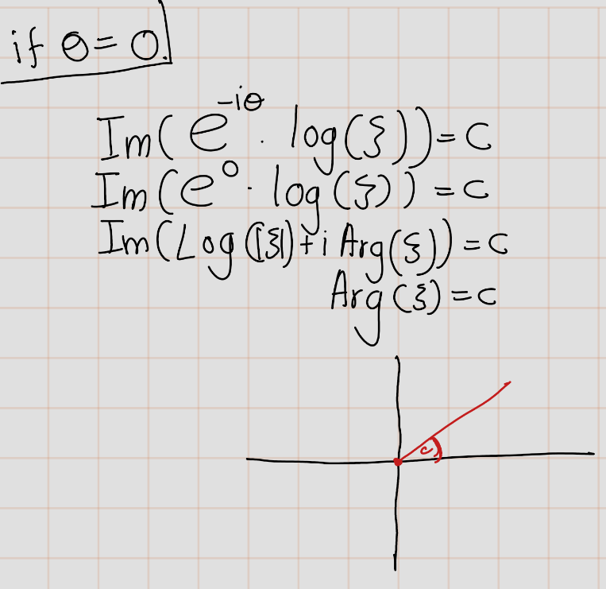

# Helical Domain

In an analogous manner, we shall find the answer to the question of univalent mapping of multiply connected domains onto a plane with cuts along arcs of logarithmic spirals and, as limiting cases, onto the plane with radial cuts and with cuts along circular arcs of concentric circles. 


For constant $\theta$ and $c$, the equation  $\Im(e^{-i\theta}\log(\xi))=c$ defines a logarithmic  spiral in the $\xi$-plane with asymptotic point at the origin.This spiral has the property that it is intersected by an arbitrary ray issuing from the origin at an angle $\theta$. 

This following plot is drawing for $\theta=1$ and

|c        |Colour |
|:--------|:------|
|$-0.5$   |Orange |
|$0$      |Cyan   |
|$-1$     |Magenta|
|$1$      |Blue   |
|$1.5$    |Red    |
|$2$      |Green  |
|$3$      |Black  |


```{python,echo=FALSE}
from sympy import *
x, y = symbols('x y')
theta=1 # We fixed theta
p=plot_implicit(x+y-1, (x, -5, 5), (y, -5, 5), show=False,line_color='white',xlabel='Im', ylabel='Re')

c=-0.5

p11=plot_implicit(log(x**2 + y**2)*sin(theta) + (atan(y/x)+0)*cos(theta) -c,
(x, 0, 5), (y, -5, 5), show=False,line_color='orange')
p12=plot_implicit(log(x**2 + y**2)*sin(theta) + (atan(y/x)+pi)*cos(theta) -c,
(x, -5, 0), (y, 0,5), show=False,line_color='orange')
p13=plot_implicit(log(x**2 + y**2)*sin(theta) + (atan(y/x)-pi)*cos(theta) -c,
(x,  -5,0), (y, -5,0), show=False,line_color='orange')


p.extend(p11)
p.extend(p12)
p.extend(p13)


c=0

p21=plot_implicit(log(x**2 + y**2)*sin(theta) + (atan(y/x)+0)*cos(theta) -c,
(x, 0, 5), (y, -5, 5), show=False,line_color='cyan')
p22=plot_implicit(log(x**2 + y**2)*sin(theta) + (atan(y/x)+pi)*cos(theta) -c,
(x, -5, 0), (y, 0,5), show=False,line_color='cyan')
p23=plot_implicit(log(x**2 + y**2)*sin(theta) + (atan(y/x)-pi)*cos(theta) -c,
(x,  -5,0), (y, -5,0), show=False,line_color='cyan')


p.extend(p21)
p.extend(p22)
p.extend(p23)


c=-1
p31=plot_implicit(log(x**2 + y**2)*sin(theta) + (atan(y/x)+0)*cos(theta) -c,
(x, 0, 5), (y, -5, 5), show=False,line_color='magenta')
p32=plot_implicit(log(x**2 + y**2)*sin(theta) + (atan(y/x)+pi)*cos(theta) -c,
(x, -5, 0), (y, 0,5), show=False,line_color='magenta')
p33=plot_implicit(log(x**2 + y**2)*sin(theta) + (atan(y/x)-pi)*cos(theta) -c,
(x,  -5,0), (y, -5,0), show=False,line_color='magenta')


p.extend(p31)
p.extend(p32)
p.extend(p33)


c=1

p41=plot_implicit(log(x**2 + y**2)*sin(theta) + (atan(y/x)+0)*cos(theta) -c,
(x, 0, 5), (y, -5, 5), show=False,line_color='blue')
p42=plot_implicit(log(x**2 + y**2)*sin(theta) + (atan(y/x)+pi)*cos(theta) -c,
(x, -5, 0), (y, 0,5), show=False,line_color='blue')
p43=plot_implicit(log(x**2 + y**2)*sin(theta) + (atan(y/x)-pi)*cos(theta) -c,
(x,  -5,0), (y, -5,0), show=False,line_color='blue')

 


p.extend(p41)
p.extend(p42)
p.extend(p43)


c=1.5

p51=plot_implicit(log(x**2 + y**2)*sin(theta) + (atan(y/x)+0)*cos(theta) -c,
(x, 0, 5), (y, -5, 5), show=False,line_color='red')
p52=plot_implicit(log(x**2 + y**2)*sin(theta) + (atan(y/x)+pi)*cos(theta) -c,
(x, -5, 0), (y, 0,5), show=False,line_color='red')
p53=plot_implicit(log(x**2 + y**2)*sin(theta) + (atan(y/x)-pi)*cos(theta) -c,
(x,  -5,0), (y, -5,0), show=False,line_color='red')


p.extend(p51)
p.extend(p52)
p.extend(p53)


c=2
p61=plot_implicit(log(x**2 + y**2)*sin(theta) + (atan(y/x)+0)*cos(theta) -c,
(x, 0, 5), (y, -5, 5), show=False,line_color='green')
p62=plot_implicit(log(x**2 + y**2)*sin(theta) + (atan(y/x)+pi)*cos(theta) -c,
(x, -5, 0), (y, 0,5), show=False,line_color='green')
p63=plot_implicit(log(x**2 + y**2)*sin(theta) + (atan(y/x)-pi)*cos(theta) -c,
(x,  -5,0), (y, -5,0), show=False,line_color='green')

 

p.extend(p61)
p.extend(p62)
p.extend(p63)


c=3

p71=plot_implicit(log(x**2 + y**2)*sin(theta) + (atan(y/x)+0)*cos(theta) -c,
(x, 0, 5), (y, -5, 5), show=False,line_color='black')
p72=plot_implicit(log(x**2 + y**2)*sin(theta) + (atan(y/x)+pi)*cos(theta) -c,
(x, -5, 0), (y, 0,5), show=False,line_color='black')
p73=plot_implicit(log(x**2 + y**2)*sin(theta) + (atan(y/x)-pi)*cos(theta) -c,
(x,  -5,0), (y, -5,0), show=False,line_color='black')


p.extend(p71)
p.extend(p72)
p.extend(p73)

p.show()
```


This following plot is drawing for $c=1$ and

|$\theta$ |Colour |
|:--------|:------|
|$-1$     |Orange |
|$-0.5$   |Cyan   |
|$0$      |Magenta|
|$1$      |Blue   |
|$1.5$    |Red    |
|$2$      |Green  |
|$2.5$    |Black  |


```{python,echo=FALSE}
from sympy import *
x, y = symbols('x y')
c=1 # We fixed constant c

p=plot_implicit(x+y-1, (x, -5, 5), (y, -5, 5), show=False,line_color='white',xlabel='Im', ylabel='Re')

theta=-1
p11=plot_implicit(log(x**2 + y**2)*sin(theta) + (atan(y/x)+0)*cos(theta) -c,
(x, 0, 5), (y, -5, 5), show=False,line_color='orange')
p12=plot_implicit(log(x**2 + y**2)*sin(theta) + (atan(y/x)+pi)*cos(theta) -c,
(x, -5, 0), (y, 0,5), show=False,line_color='orange')
p13=plot_implicit(log(x**2 + y**2)*sin(theta) + (atan(y/x)-pi)*cos(theta) -c,
(x,  -5,0), (y, -5,0), show=False,line_color='orange')


p.extend(p11)
p.extend(p12)
p.extend(p13)


theta=-0.5

p21=plot_implicit(log(x**2 + y**2)*sin(theta) + (atan(y/x)+0)*cos(theta) -c,
(x, 0, 5), (y, -5, 5), show=False,line_color='cyan')
p22=plot_implicit(log(x**2 + y**2)*sin(theta) + (atan(y/x)+pi)*cos(theta) -c,
(x, -5, 0), (y, 0,5), show=False,line_color='cyan')
p23=plot_implicit(log(x**2 + y**2)*sin(theta) + (atan(y/x)-pi)*cos(theta) -c,
(x,  -5,0), (y, -5,0), show=False,line_color='cyan')


p.extend(p21)
p.extend(p22)
p.extend(p23)


theta=0
p31=plot_implicit(log(x**2 + y**2)*sin(theta) + (atan(y/x)+0)*cos(theta) -c,
(x, 0, 5), (y, -5, 5), show=False,line_color='magenta')
p32=plot_implicit(log(x**2 + y**2)*sin(theta) + (atan(y/x)+pi)*cos(theta) -c,
(x, -5, 0), (y, 0,5), show=False,line_color='magenta')
p33=plot_implicit(log(x**2 + y**2)*sin(theta) + (atan(y/x)-pi)*cos(theta) -c,
(x,  -5,0), (y, -5,0), show=False,line_color='magenta')


p.extend(p31)
p.extend(p32)
p.extend(p33)


theta=1.5

p41=plot_implicit(log(x**2 + y**2)*sin(theta) + (atan(y/x)+0)*cos(theta) -c,
(x, 0, 5), (y, -5, 5), show=False,line_color='blue')
p42=plot_implicit(log(x**2 + y**2)*sin(theta) + (atan(y/x)+pi)*cos(theta) -c,
(x, -5, 0), (y, 0,5), show=False,line_color='blue')
p43=plot_implicit(log(x**2 + y**2)*sin(theta) + (atan(y/x)-pi)*cos(theta) -c,
(x,  -5,0), (y, -5,0), show=False,line_color='blue')


p.extend(p41)
p.extend(p42)
p.extend(p43)


theta=1.5

p51=plot_implicit(log(x**2 + y**2)*sin(theta) + (atan(y/x)+0)*cos(theta) -c,
(x, 0, 5), (y, -5, 5), show=False,line_color='red')
p52=plot_implicit(log(x**2 + y**2)*sin(theta) + (atan(y/x)+pi)*cos(theta) -c,
(x, -5, 0), (y, 0,5), show=False,line_color='red')
p53=plot_implicit(log(x**2 + y**2)*sin(theta) + (atan(y/x)-pi)*cos(theta) -c,
(x,  -5,0), (y, -5,0), show=False,line_color='red')

 


p.extend(p51)
p.extend(p52)
p.extend(p53)


theta=2
p61=plot_implicit(log(x**2 + y**2)*sin(theta) + (atan(y/x)+0)*cos(theta) -c,
(x, 0, 5), (y, -5, 5), show=False,line_color='green')
p62=plot_implicit(log(x**2 + y**2)*sin(theta) + (atan(y/x)+pi)*cos(theta) -c,
(x, -5, 0), (y, 0,5), show=False,line_color='green')
p63=plot_implicit(log(x**2 + y**2)*sin(theta) + (atan(y/x)-pi)*cos(theta) -c,
(x,  -5,0), (y, -5,0), show=False,line_color='green')

 

p.extend(p61)
p.extend(p62)
p.extend(p63)


theta=2.5

p71=plot_implicit(log(x**2 + y**2)*sin(theta) + (atan(y/x)+0)*cos(theta) -c,
(x, 0, 5), (y, -5, 5), show=False,line_color='black')
p72=plot_implicit(log(x**2 + y**2)*sin(theta) + (atan(y/x)+pi)*cos(theta) -c,
(x, -5, 0), (y, 0,5), show=False,line_color='black')
p73=plot_implicit(log(x**2 + y**2)*sin(theta) + (atan(y/x)-pi)*cos(theta) -c,
(x,  -5,0), (y, -5,0), show=False,line_color='black')


p.extend(p71)
p.extend(p72)
p.extend(p73)

p.show()
```

This follows, for example, from the fact that if we shift to the plane $t = \log(\xi)$, this logarithmic spiral is mapped into the straight line $e^{-i\theta t} = c$ with inclination $\theta$ to the real axis, and the ray referred to is mapped into a straight line parallel to the real axis. 

```{r echo=FALSE}
  knitr::include_graphics('figures/Helical_Domain/fig1.png')
```


- For $\theta = 0$, the logarithmic spiral degenerates into a ray issuing from the origin. 

```{r,echo=FALSE,fig.align='center'}
  
```

|$c$      |Colour |
|:-------:|:------|
|$-0.5$   |Cyan   |
|$-1$     |Orange |
|$0$      |Magenta|
|$0.3$    |Black  |
|$1$      |Blue   |
|$1.5$    |Red    |
|$2$      |Green  |

```{python,echo=FALSE}
from sympy import *
x, y = symbols('x y')
theta=0 # We fixed theta
p=plot_implicit(x+y-1, (x, -5, 5), (y, -5, 5), show=False,line_color='white',xlabel='Im', ylabel='Re',title='Logrithmic Spiral \n (theta=0)')


c=-0.5

p11=plot_implicit(log(x**2 + y**2)*sin(theta) + (atan(y/x)+0)*cos(theta) -c,
(x, 0, 5), (y, -5, 5), show=False,line_color='orange')
p12=plot_implicit(log(x**2 + y**2)*sin(theta) + (atan(y/x)+pi)*cos(theta) -c,
(x, -5, 0), (y, 0,5), show=False,line_color='orange')
p13=plot_implicit(log(x**2 + y**2)*sin(theta) + (atan(y/x)-pi)*cos(theta) -c,
(x,  -5,0), (y, -5,0), show=False,line_color='orange')


p.extend(p11)
p.extend(p12)
p.extend(p13)


c=0

p21=plot_implicit(log(x**2 + y**2)*sin(theta) + (atan(y/x)+0)*cos(theta) -c,
(x, 0, 5), (y, -5, 5), show=False,line_color='cyan')
p22=plot_implicit(log(x**2 + y**2)*sin(theta) + (atan(y/x)+pi)*cos(theta) -c,
(x, -5, 0), (y, 0,5), show=False,line_color='cyan')
p23=plot_implicit(log(x**2 + y**2)*sin(theta) + (atan(y/x)-pi)*cos(theta) -c,
(x,  -5,0), (y, -5,0), show=False,line_color='cyan')


p.extend(p21)
p.extend(p22)
p.extend(p23)


c=-1
p31=plot_implicit(log(x**2 + y**2)*sin(theta) + (atan(y/x)+0)*cos(theta) -c,
(x, 0, 5), (y, -5, 5), show=False,line_color='magenta')
p32=plot_implicit(log(x**2 + y**2)*sin(theta) + (atan(y/x)+pi)*cos(theta) -c,
(x, -5, 0), (y, 0,5), show=False,line_color='magenta')
p33=plot_implicit(log(x**2 + y**2)*sin(theta) + (atan(y/x)-pi)*cos(theta) -c,
(x,  -5,0), (y, -5,0), show=False,line_color='magenta')


p.extend(p31)
p.extend(p32)
p.extend(p33)


c=1

p41=plot_implicit(log(x**2 + y**2)*sin(theta) + (atan(y/x)+0)*cos(theta) -c,
(x, 0, 5), (y, -5, 5), show=False,line_color='blue')
p42=plot_implicit(log(x**2 + y**2)*sin(theta) + (atan(y/x)+pi)*cos(theta) -c,
(x, -5, 0), (y, 0,5), show=False,line_color='blue')
p43=plot_implicit(log(x**2 + y**2)*sin(theta) + (atan(y/x)-pi)*cos(theta) -c,
(x,  -5,0), (y, -5,0), show=False,line_color='blue')

 


p.extend(p41)
p.extend(p42)
p.extend(p43)


c=1.5

p51=plot_implicit(log(x**2 + y**2)*sin(theta) + (atan(y/x)+0)*cos(theta) -c,
(x, 0, 5), (y, -5, 5), show=False,line_color='red')
p52=plot_implicit(log(x**2 + y**2)*sin(theta) + (atan(y/x)+pi)*cos(theta) -c,
(x, -5, 0), (y, 0,5), show=False,line_color='red')
p53=plot_implicit(log(x**2 + y**2)*sin(theta) + (atan(y/x)-pi)*cos(theta) -c,
(x,  -5,0), (y, -5,0), show=False,line_color='red')

 


p.extend(p51)
p.extend(p52)
p.extend(p53)


c=2
p61=plot_implicit(log(x**2 + y**2)*sin(theta) + (atan(y/x)+0)*cos(theta) -c,
(x, 0, 5), (y, -5, 5), show=False,line_color='green')
p62=plot_implicit(log(x**2 + y**2)*sin(theta) + (atan(y/x)+pi)*cos(theta) -c,
(x, -5, 0), (y, 0,5), show=False,line_color='green')
p63=plot_implicit(log(x**2 + y**2)*sin(theta) + (atan(y/x)-pi)*cos(theta) -c,
(x,  -5,0), (y, -5,0), show=False,line_color='green')

 

p.extend(p61)
p.extend(p62)
p.extend(p63)


c=3

p71=plot_implicit(log(x**2 + y**2)*sin(theta) + (atan(y/x)+0)*cos(theta) -c,
(x, 0, 5), (y, -5, 5), show=False,line_color='black')
p72=plot_implicit(log(x**2 + y**2)*sin(theta) + (atan(y/x)+pi)*cos(theta) -c,
(x, -5, 0), (y, 0,5), show=False,line_color='black')
p73=plot_implicit(log(x**2 + y**2)*sin(theta) + (atan(y/x)-pi)*cos(theta) -c,
(x,  -5,0), (y, -5,0), show=False,line_color='black')


p.extend(p71)
p.extend(p72)
p.extend(p73)


c=-2

p81=plot_implicit(log(x**2 + y**2)*sin(theta) + (atan(y/x)+0)*cos(theta) -c,
(x, 0, 5), (y, -5, 5), show=False,line_color='olive')
p82=plot_implicit(log(x**2 + y**2)*sin(theta) + (atan(y/x)+pi)*cos(theta) -c,
(x,-5, 0), (y, 0,5), show=False,line_color='olive')
p83=plot_implicit(log(x**2 + y**2)*sin(theta) + (atan(y/x)-pi)*cos(theta) -c,
(x,-5,0), (y, -5,0), show=False,line_color='olive')

 
p.extend(p81)
p.extend(p82)
p.extend(p83)


p.show()
```


- For $\theta = \frac{\pi}{2}$, it degenerates to a circle with center at the origin.

```{r echo=FALSE}
  knitr::include_graphics('figures/Helical_Domain/fig3.png')
```

This following plot is drawing for $\theta=\frac{\pi}{2}$ and

|$c$      |Colour |
|:--------|:------|
|$-0.5$   |Orange |
|$0$      |Cyan   |
|$-1$     |Magenta|
|$1$      |Blue   |
|$1.5$    |Red    |
|$2$      |Green  |
|$3$      |Black  |

```{python,echo=FALSE}
from sympy import *
x, y = symbols('x y')
theta=pi/2 # We fixed theta
p=plot_implicit(x+y-1,
(x, -5, 5), (y, -5, 5), show=False,line_color='white',xlabel='Im', ylabel='Re',title='Logrithmic Spiral \n (theta$=\pi/2$)')


c=-0.5

p11=plot_implicit(log(x**2 + y**2)*sin(theta) + (atan(y/x)+0)*cos(theta) -c,
(x, 0, 5), (y, -5, 5), show=False,line_color='orange')
p12=plot_implicit(log(x**2 + y**2)*sin(theta) + (atan(y/x)+pi)*cos(theta) -c,
(x, -5, 0), (y, 0,5), show=False,line_color='orange')
p13=plot_implicit(log(x**2 + y**2)*sin(theta) + (atan(y/x)-pi)*cos(theta) -c,
(x,  -5,0), (y, -5,0), show=False,line_color='orange')
p14=plot_implicit(log(x**2 + y**2)*sin(theta) + (atan(y/x)+0)*cos(theta) -c,
(x, 0,5), (y, -5,0), show=False,line_color='orange')

p.extend(p11)
p.extend(p12)
p.extend(p13)


c=0

p21=plot_implicit(log(x**2 + y**2)*sin(theta) + (atan(y/x)+0)*cos(theta) -c,
(x, 0, 5), (y, -5, 5), show=False,line_color='cyan')
p22=plot_implicit(log(x**2 + y**2)*sin(theta) + (atan(y/x)+pi)*cos(theta) -c,
(x, -5, 0), (y, 0,5), show=False,line_color='cyan')
p23=plot_implicit(log(x**2 + y**2)*sin(theta) + (atan(y/x)-pi)*cos(theta) -c,
(x,  -5,0), (y, -5,0), show=False,line_color='cyan')


p.extend(p21)
p.extend(p22)
p.extend(p23)


c=-1
p31=plot_implicit(log(x**2 + y**2)*sin(theta) + (atan(y/x)+0)*cos(theta) -c,
(x, 0, 5), (y, -5, 5), show=False,line_color='magenta')
p32=plot_implicit(log(x**2 + y**2)*sin(theta) + (atan(y/x)+pi)*cos(theta) -c,
(x, -5, 0), (y, 0,5), show=False,line_color='magenta')
p33=plot_implicit(log(x**2 + y**2)*sin(theta) + (atan(y/x)-pi)*cos(theta) -c,
(x,  -5,0), (y, -5,0), show=False,line_color='magenta')


p.extend(p31)
p.extend(p32)
p.extend(p33)


c=1

p41=plot_implicit(log(x**2 + y**2)*sin(theta) + (atan(y/x)+0)*cos(theta) -c,
(x, 0, 5), (y, -5, 5), show=False,line_color='blue')
p42=plot_implicit(log(x**2 + y**2)*sin(theta) + (atan(y/x)+pi)*cos(theta) -c,
(x, -5, 0), (y, 0,5), show=False,line_color='blue')
p43=plot_implicit(log(x**2 + y**2)*sin(theta) + (atan(y/x)-pi)*cos(theta) -c,
(x,  -5,0), (y, -5,0), show=False,line_color='blue')

 


p.extend(p41)
p.extend(p42)
p.extend(p43)


c=1.5

p51=plot_implicit(log(x**2 + y**2)*sin(theta) + (atan(y/x)+0)*cos(theta) -c,
(x, 0, 5), (y, -5, 5), show=False,line_color='red')
p52=plot_implicit(log(x**2 + y**2)*sin(theta) + (atan(y/x)+pi)*cos(theta) -c,
(x, -5, 0), (y, 0,5), show=False,line_color='red')
p53=plot_implicit(log(x**2 + y**2)*sin(theta) + (atan(y/x)-pi)*cos(theta) -c,
(x,  -5,0), (y, -5,0), show=False,line_color='red')

 


p.extend(p51)
p.extend(p52)
p.extend(p53)


c=2
p61=plot_implicit(log(x**2 + y**2)*sin(theta) + (atan(y/x)+0)*cos(theta) -c,
(x, 0, 5), (y, -5, 5), show=False,line_color='green')
p62=plot_implicit(log(x**2 + y**2)*sin(theta) + (atan(y/x)+pi)*cos(theta) -c,
(x, -5, 0), (y, 0,5), show=False,line_color='green')
p63=plot_implicit(log(x**2 + y**2)*sin(theta) + (atan(y/x)-pi)*cos(theta) -c,
(x,  -5,0), (y, -5,0), show=False,line_color='green')

 

p.extend(p61)
p.extend(p62)
p.extend(p63)


c=3

p71=plot_implicit(log(x**2 + y**2)*sin(theta) + (atan(y/x)+0)*cos(theta) -c,
(x, 0, 5), (y, -5, 5), show=False,line_color='black')
p72=plot_implicit(log(x**2 + y**2)*sin(theta) + (atan(y/x)+pi)*cos(theta) -c,
(x, -5, 0), (y, 0,5), show=False,line_color='black')
p73=plot_implicit(log(x**2 + y**2)*sin(theta) + (atan(y/x)-pi)*cos(theta) -c,
(x,  -5,0), (y, -5,0), show=False,line_color='black')


p.extend(p71)
p.extend(p72)
p.extend(p73)

p.show()
```

When we hold $c$ constant and vary $\theta$, we obtain various curves constituting the family of logarithmic spirals of inclination $\theta$. For all that follows, when we speak of logarithmic spirals of inclination $\theta$, these are what we mean. 

Let us show that, for any simply connected domain \(B\) that has boundary points, it is possible to map \(B\) onto the complex plane \(\mathbb{C}\) with a cut along an arc of a logarithmic spiral of inclination \(\theta\) in such a way that given points \(a\) and \(b\) of the domain \(B\) are mapped into \(0\) and \(\infty\), respectively. The expansion of the mapping function about \(z = b\) has the form:

\[ \frac{1}{z - b} +a_0+a_1{(z - b)} +\cdots\text{ or }  z+a_0+\frac{a_1}{z} +  + \cdots, \]

according as \(b\) is finite or infinite. 


- If domain \(B\) has **a single boundary point**,\
 this is obvious, and then the arc of the logarithmic spiral referred to degenerates to a point. 
 
- If the boundary of the domain \(B\) is **a continuum**,\
let us first map \(B\) conformally onto the domain \(\{z' : |z'| > 1\}\) in such a way that the point \(z = b\) is mapped into \(z' = \infty\). 


Let \(z'\) be the mapping function \(cP(z)\) in a neighbourhood of \(z = b\). The expansion can be expressed as:

\[
z' = cP(z) = \frac{1}{b} + \frac{1}{1} (z - b) + \frac{1}{1!} (z - b)^2 + \frac{1}{0!} (z - b)^3 + \ldots
\]

or

\[
z' = cP(z) = \frac{1}{b} + \frac{1}{1}z + \frac{1}{1!}z^2 + \frac{1}{0!}z^3 + \ldots
\]

depending on whether \(b\) is finite or infinite. This expansion is possible due to Riemann's theorem.

Suppose that the point \(z = a\) is mapped into a point \(z' = a'\). Now, we need to establish the possibility of mapping the domain \(\lvert z' \rvert > 1\) onto the complex plane with a cut along a logarithmic spiral of inclination \(\epsilon\). This possibility follows from solving the problem related to the minimum of the quantity:

\[
 \Re(e^{-2i\theta} \log (F'(a))
\]

in the class I. This problem was studied in Section 3 of Chapter IV (the first application of Theorem 1 with \(a = \frac{17}{2} - \epsilon\)). It was shown that this problem has a solution, and the extremal function (normalized by the condition \(F(a') = 0\)) provides the required mapping. 

```{lemma}
Out of all functions 
$$
\xi=F(z) := z + \frac{a}{z} + a_0 + \ldots
$$
that map the domain \(|z| > R\)  univalently in such a way that a given finite point \(a\) and the point \(\infty\) are 
mapped into the poi nts $0$ and \(\infty\) respectively, the quantity  \(\Re(e^{-2i\theta} \log (F'(a))\)
is minimized by the function $F_0(z)$ that maps the disk \(|z| > R\) onto the $\xi$-plane with cut along an arc of a logarithmic spiral of inclination $\theta$. Here $\log F '(z)$ means the brooch that approaches $0$ as $z \to \infty$. 
```

```{theorem}
 Every domain \(B\) in the \(z\)-plane can be mapped univalently onto a domain \(B'\) in the \(\xi\)-plane that includes the points 0 and \(\infty\), such that an arbitrary continuum of the complement of the domain \(B'\) with respect to the \(\xi\)-plane is an arc of a logarithmic spiral of given inclination \(\theta\). This mapping maps given points \(a\) and \(b\) of the domain \(B\) into 0 and \(\infty\), respectively, and the expansion of the mapping function about \(z = b\) has the form \((z - b)^{-1} + a_0 + a_1 (z - b) + \cdots\) or \(z + a_0 + a_1 z^{-1} + \cdots\), according as \(b\) is finite or infinite.
```

*Proof.* We may assume that \(b = \infty\) because, if this is not the case, we can use the transformation \(z^* = \frac{1}{z - b}\) to switch from domain \(B\) to a new domain \(B'\). Then we can prove the theorem for this last domain, replacing \(a\) and \(b\) with \(\frac{1}{a-b}\) and \(\infty\).

- **Simply Connected Domains**
- **Multiple Connected Domains**\
Let $B$ be an multiply connected domain.
\[\mathcal{F}:=\left\{ f:B \rightarrow \hat{\mathbb{C}}\left|
\begin{array}{l}
f \text{ is univalent on  } B \text { and } \\
f(a)=0 \text{ and } f(\infty)=\infty \text { and }\\ 
\text{that have an exapansion }f(z)=z+a_0+\frac{a_1}{z}+cdots \text{ as } n\rightarrow \infty\end{array}\right. \right\}\]


